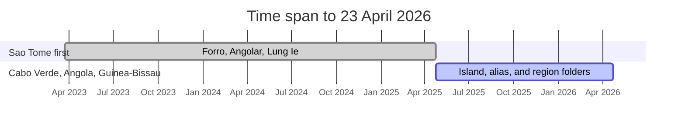
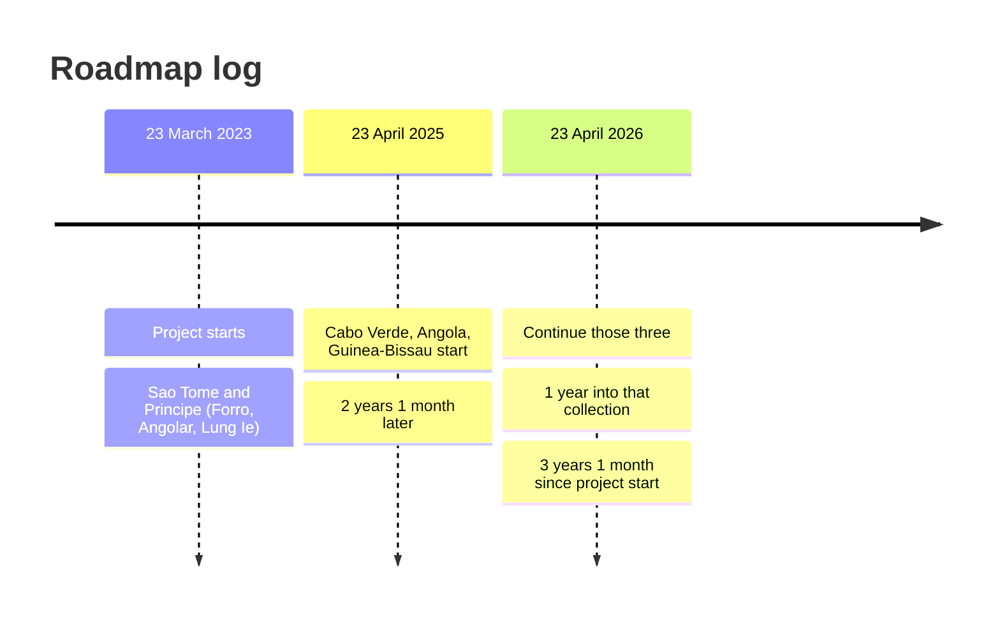

# ForroVivo Linguistic Research

Open, source-traced dictionary data for Portuguese-lexifier creoles.

**ForroVivo** is the platform and ecosystem. This repository is the **Linguistic Research** initiative within it: attested lexicons, isolation rules, and a read-only API. The website UI and the App Store app are not stored here.

[Website](https://www.forrovivo.com) · [API](https://api.forrovivo.com) · [App Store](https://apps.apple.com/app/id6751409176) · [Roadmap](#collection-roadmap) · [Methodology](docs/methodology.md) · [Contribute](CONTRIBUTING.md)

[](https://www.forrovivo.com)
[](https://api.forrovivo.com)
[](https://apps.apple.com/app/id6751409176)
[](LICENSE)

| Surface | Role |
|---|---|
| [ForroVivo.com](https://www.forrovivo.com) | Public brand |
| [This GitHub repository](https://github.com/Forrovivo/LINGUISTIC-RESEARCH-Forro-Vivo-) | Open research and datasets |
| [api.forrovivo.com](https://api.forrovivo.com) | Machine-readable linguistic data |
| [ForroVivo on the App Store](https://apps.apple.com/app/id6751409176) | Language-learning product |

**Project started:** 23 March 2023

Accuracy comes before coverage. A missing translation is better than a guessed one. If a term is not attested for that language, the dataset records `TERM_NOT_FOUND`.

## Languages

Each language is its own lexicon. Relatedness is not a licence to copy vocabulary.

| Language | Autonym | ISO 639-3 | Path | Translation pairs |
|---|---|---|---|---|
| Forro / Santome / Santomense | *lungwa santome* | cri | [`data/saotome/forro/`](data/saotome/forro/) | Forro ↔ Portuguese, Forro ↔ English |
| Angolar / Ngola | *n'golá* | aoa | [`data/saotome/angolar/`](data/saotome/angolar/) | Angolar ↔ Portuguese, Angolar ↔ English |
| Principense / Lung’Ie | *lung’Ie* | pre | [`data/saotome/lungie/`](data/saotome/lungie/) | Lung’Ie ↔ Portuguese, Lung’Ie ↔ English |
| Kabuverdianu / Kriolu | island varieties | kea | [`data/caboverde/<island>/`](data/caboverde/) | that island ↔ Portuguese, that island ↔ English |
| Kriol / Kiriol of Guinea-Bissau | regional varieties | pov | [`data/guinebissau/<region>/`](data/guinebissau/) | that region ↔ Portuguese, that region ↔ English |

The São Tomé and Príncipe languages are Gulf of Guinea creoles. They are not mutually intelligible. Cabo Verdean island creoles and Guinea-Bissau regional Kriol are Upper Guinea creoles; they are not the same language.

Cabo Verde is stored one inhabited island per folder. Guinea-Bissau is stored one region per folder. [`data/angola/`](data/angola/) is an alias of Angolar, not a second lexicon. Portuguese is not a creole: São Toméan Portuguese is not Forro, Angolar, or Lung’Ie.

## Principles

1. **No invented words.** Every form, gloss, example, pronunciation, and cultural note must come from a cited source.
2. **Language isolation.** Never copy a word from one folder into another because the spellings look similar. Islands and regions are not interchangeable. Cabo Verdean Kabuverdianu is not Guinea-Bissau Kriol.
3. **Source on every entry.** Record the work, page or URL, and a confidence level.
4. **Orthography fidelity.** Keep the spelling used in the source. Do not normalize one language into another.
5. **Missing data is explicit.** Do not fill a gap by analogy, and do not creolize Portuguese.

Full collection rules: [docs/methodology.md](docs/methodology.md) · [research/notes/collection-prompt.md](research/notes/collection-prompt.md)

## Technology Stack

This repository is attested datasets plus a read-only API. The ForroVivo.com site and the App Store product are separate codebases.

| Layer | Stack |
|---|---|
| Lexicons | JSON and Markdown under `data/` |
| Validation | JSON Schema in `schema/` |
| Audio | MPEG recordings linked from matching entries |
| API | Python, FastAPI, Uvicorn |
| Contract | OpenAPI (`api/openapi.yaml`) |
| Runtime | In-memory indexes over the real `dictionary.json` files |
| Tests | pytest, using attested headwords from the lexicons |
| Tooling | Python scripts in `scripts/` (`validate-data`, `import-data`, `build-index`) |
| Public host | `api.forrovivo.com` |

Dependencies: [api/requirements.txt](api/requirements.txt). Design notes: [research/notes/tech-report.md](research/notes/tech-report.md)

## Repository layout

```text
.
├── api/                 Read-only Linguistic Research API
├── data/
│   ├── saotome/         Country index — Forro, Angolar, Lung’Ie
│   ├── caboverde/       One folder per inhabited island
│   ├── guinebissau/     One folder per region
│   └── angola/          Alias of data/saotome/angolar/
├── docs/                Methodology, data model, API guide
├── research/
│   ├── sources/         Bibliography
│   ├── publications/    Source PDFs
│   └── notes/           Collection prompt and technical notes
├── schema/              JSON Schema
├── scripts/             validate-data, import-data, build-index
├── CONTRIBUTING.md
├── LICENSE
└── README.md
```

Parent folders are indexes, not merged word lists. Dataset index: [data/index.md](data/index.md)

| Folder | Isolation rule |
|---|---|
| `data/saotome/` | One language per folder. Do not copy between Forro, Angolar, and Lung’Ie. |
| `data/caboverde/` | A form labelled only “Cape Verdean” stays out of island folders. |
| `data/guinebissau/` | A form labelled only “Guinea-Bissau Kriol” stays out of region folders. Do not insert Casamance Kriyol. |
| `data/angola/` | Do not grow a second lexicon. Use `data/saotome/angolar/`. |

Forro is extracted from *Dicionário livre santome/português*. Angolar and Lung’Ie are isolated from sources that document those languages. Cabo Verde and Guinea-Bissau folders grow only when a cited source names the island or region.

## Dictionary API

Public host: **https://api.forrovivo.com** · Contract: [api/openapi.yaml](api/openapi.yaml) · Guide: [docs/api.md](docs/api.md)

The API is GET-only. It loads the JSON files under `data/`. It does not invent translations, merge languages, or write lexicon data.

```bash
curl "https://api.forrovivo.com/v1/saotome/forro/lookup?headword=kume"
```

| Method | Path |
|---|---|
| GET | `/v1` |
| GET | `/v1/datasets` |
| GET | `/v1/saotome/forro/lookup?headword=` |
| GET | `/v1/saotome/angolar/lookup?headword=` |
| GET | `/v1/saotome/lungie/lookup?headword=` |
| GET | `/v1/caboverde/{island}/lookup?headword=` |
| GET | `/v1/guinebissau/{region}/lookup?headword=` |
| GET | `/v1/angola/lookup?headword=` |

`/v1/saotome`, `/v1/caboverde`, and `/v1/guinebissau` are indexes: lookup there returns `TERM_NOT_FOUND`. `/v1/angola` serves Angolar without duplicating the word list. Search never crosses folders.

Run locally:

```bash
python3 -m venv .venv
source .venv/bin/activate
pip install -r api/requirements.txt
PYTHONPATH=. uvicorn api.main:app --reload --host 127.0.0.1 --port 8000
```

Interactive docs: https://api.forrovivo.com/docs

## Collection roadmap

Calendar intervals are measured between named dates. They do not use a live clock.

| Project started | Cabo Verde, Angola, Guinea-Bissau started | Gap after project start | 23 April 2025 to 23 April 2026 |
|---|---|---|---|
| 23 March 2023 | 23 April 2025 | **2 years 1 month** | **1 year** |

From 23 March 2023 to 23 April 2025 is **2 years 1 month**. From 23 April 2025 to 23 April 2026 is **1 year**. From 23 March 2023 to 23 April 2026 is **3 years 1 month**.



São Tomé collection for Forro, Angolar, and Lung’Ie began with the project on 23 March 2023. That work is not delayed to 2025. Twenty-five months of São Tomé work first, then twelve months of Cabo Verde, Angola, and Guinea-Bissau collection, through 23 April 2026.



| Date | What started | Time since 23 March 2023 | Status |
|---|---|---|---|
| 23 March 2023 | Project. São Tomé and Príncipe (Forro, Angolar, Lung’Ie). | Start | Under way |
| 23 April 2025 | Cabo Verde (by island), Angola (Angolar alias), Guinea-Bissau (by region). | 2 years 1 month later | Folders ready; lexicons grow from labelled sources |
| 2026 / 23 April 2026 | Continue Cabo Verde, Angola, and Guinea-Bissau from labelled sources only. | 3 years 1 month later (on 23 April 2026) | Collection year |

Cabo Verdean Kabuverdianu is not Guinea-Bissau Kriol. Angola in this repository is Angolar, not Kimbundu, Umbundu, or Angolan Portuguese.

## Documentation

| File | Role |
|---|---|
| [CONTRIBUTING.md](CONTRIBUTING.md) | How to add attested entries |
| [docs/methodology.md](docs/methodology.md) | Isolation and verification |
| [docs/data-model.md](docs/data-model.md) | Entry model |
| [docs/api.md](docs/api.md) | Public API |
| [research/sources/README.md](research/sources/README.md) | Bibliography |
| [research/notes/tech-report.md](research/notes/tech-report.md) | Technical design |
| [data/index.md](data/index.md) | Dataset map |

## Contributing

See [CONTRIBUTING.md](CONTRIBUTING.md). Contributions should add **attested** data, not guessed translations.

- Keep each creole, island, and region in its own folder.
- Cite a source for every new field.
- Copy example sentences from the source; do not invent them.
- Mark disagreements instead of silently choosing one form.
- Do not add ForroVivo website UI, App Store app code, or write APIs that invent translations.

Wikipedia, social media, unsourced word lists, and generated text are not accepted as the only evidence for an entry.

## License

Original project materials (this README, collection rules, compilation structure, and independently authored notes) are [CC BY 4.0](https://creativecommons.org/licenses/by/4.0/). That license covers **this project’s own work**. It does not replace the licenses of the dictionaries and papers cited here.

| Material | Rights |
|---|---|
| *Dicionário livre santome/português* (Araujo & Hagemeijer, 2013) | CC BY-NC. Attribution required. Non-commercial only. |
| APiCS Online (Michaelis et al., 2013), including Santome audio | CC BY 4.0. Cite Hagemeijer and the APiCS editors. |
| Other academic publications | Publisher or author terms. Cite them. Do not treat them as CC BY 4.0. |

Suggested attribution:

> ForroVivo Linguistic Research, available under CC BY 4.0. Includes material from Araujo & Hagemeijer (2013), *Dicionário livre santome/português*, CC BY-NC.

Full legal text: [LICENSE](LICENSE)
