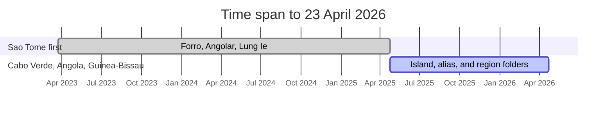
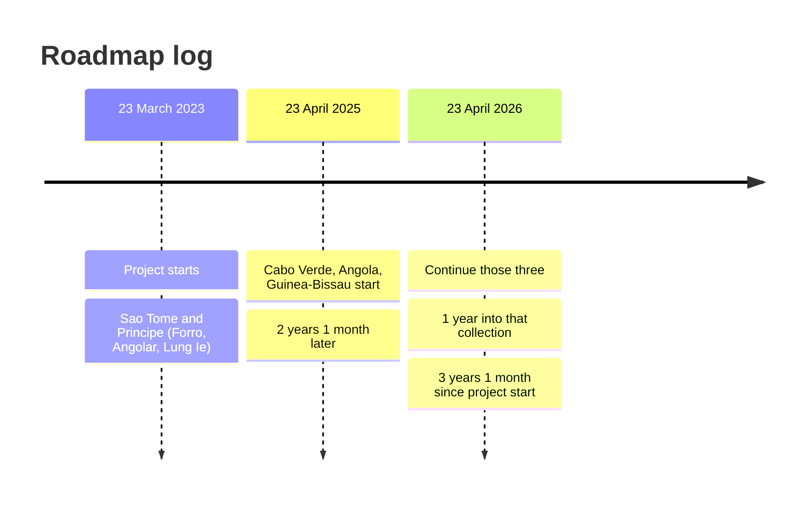

<div align="center">

# ForroVivo Linguistic Research

**Open dictionary data for living creoles.**  
No invented words. No mixed languages. Missing beats guessing.

[](https://www.forrovivo.com)
[](https://api.forrovivo.com)
[](https://apps.apple.com/app/id6751409176)
[](LICENSE)

[](data/saotome_dataset/forro/)
[](data/saotome_dataset/angolar/)
[](data/saotome_dataset/lungie/)
[](data/caboverde_dataset/)
[](data/guinebissau_dataset/)
[](data/angola_dataset/)

</div>

> **30-second version**  
> **ForroVivo** = the platform. **This repo** = the open research lab inside it.  
> Click a language. Or hit the API. If a word is not attested, you get `TERM_NOT_FOUND` — not a guess.

Jump:

[](#start-here)
[](#languages)
[](#house-rules)
[](#technology-stack)
[](#repository-layout)
[](#dictionary-api)
[](#knowledge-base)
[](#collection-roadmap)
[](#contributing)

---

<a id="start-here"></a>

## 🚀 Start here

**ForroVivo** is the platform and ecosystem. This GitHub folder is the **Linguistic Research** initiative: attested lexicons + a read-only API.

The website UI and the App Store app live somewhere else. Not here.

| 🟢 Brand | 🟣 Research | 🔵 Data | ⚫ Product |
|---|---|---|---|
| [ForroVivo.com](https://www.forrovivo.com) | [This repo](https://github.com/Forrovivo/LINGUISTIC-RESEARCH-Forro-Vivo-) | [api.forrovivo.com](https://api.forrovivo.com) | [App Store](https://apps.apple.com/app/id6751409176) |

**Project started:** 23 March 2023

---

<a id="languages"></a>

## 🗺️ Languages

Each language is its **own** box. Looking similar ≠ same word. Do not copy between folders.

|  | Language | Autonym | ISO | Open it | Pairs |
|---|---|---|---|---|---|
| 🇸🇹 | **Forro** / Santome | *lungwa santome* | `cri` | [`data/saotome_dataset/forro/`](data/saotome_dataset/forro/) | Forro ↔ PT, Forro ↔ EN |
| 🇸🇹 | **Angolar** / Ngola | *n'golá* | `aoa` | [`data/saotome_dataset/angolar/`](data/saotome_dataset/angolar/) | Angolar ↔ PT, Angolar ↔ EN |
| 🇸🇹 | **Lung’Ie** / Principense | *lung’Ie* | `pre` | [`data/saotome_dataset/lungie/`](data/saotome_dataset/lungie/) | Lung’Ie ↔ PT, Lung’Ie ↔ EN |
| 🇨🇻 | **Kabuverdianu** | island varieties | `kea` | [`data/caboverde_dataset/`](data/caboverde_dataset/) | that island ↔ PT / EN |
| 🇬🇼 | **Kriol** / Kiriol | regional varieties | `pov` | [`data/guinebissau_dataset/`](data/guinebissau_dataset/) | that region ↔ PT / EN |
| 🇦🇴 | **Angola Contruy** | Angola (country) | — | [`data/angola_dataset/`](data/angola_dataset/) | Angola Contruy ↔ PT / EN |

**Brain sticky notes**

- São Tomé trio = Gulf of Guinea creoles. **Not** mutually intelligible.
- Cabo Verde + Guinea-Bissau = Upper Guinea creoles. **Not** the same language.
- Cabo Verde = **one island, one folder**. Guinea-Bissau = **one region, one folder**.
- [`data/angola_dataset/`](data/angola_dataset/) = **Angola Contruy** (country). **Not** Angolar.
- Portuguese is **not** a creole. São Toméan Portuguese is not Forro, Angolar, or Lung’Ie.

---

<a id="house-rules"></a>

## 📏 House rules

One line each. Stick them on the fridge.

| ✅ Do | ❌ Don’t |
|---|---|
| Cite a source for every field | Invent a translation |
| Keep the source spelling | “Normalize” one language into another |
| Leave a gap empty | Fill it from another creole because it *looks* close |
| Record disagreements | Silently pick a winner |
| Return `TERM_NOT_FOUND` | Creolize Portuguese to fake a hit |

1. **No invented words.** Form, gloss, example, sound, culture — cited or out.
2. **Isolation.** Islands are not interchangeable. Regions are not interchangeable. Kabuverdianu is not Guinea-Bissau Kriol.
3. **Missing is honest.** Empty is better than a guess.

Full rules: [methodology](docs/methodology.md) · [collection prompt](research/notes/collection-prompt.md)

---

<a id="technology-stack"></a>

## 🛠️ Technology Stack

This repo = datasets + a GET-only API.  
ForroVivo.com and the App Store app = other codebases.

| Layer | What we use |
|---|---|
| 📚 Lexicons | JSON + Markdown in `data/` |
| 🧠 Knowledge Base | Optional `knowledge.json` per isolated folder |
| 🧪 Validation | JSON Schema in `schema/` |
| 🔊 Audio | MPEG, linked from matching entries |
| ⚡ API | Python · FastAPI · Uvicorn |
| 📜 Contract | OpenAPI → [`api/openapi.yaml`](api/openapi.yaml) |
| 🧠 Runtime | In-memory indexes over the **real** `dictionary.json` files |
| ✅ Tests | pytest, using attested headwords |
| 🧰 Scripts | `validate-data` · `import-data` · `build-index` |
| 🌍 Host | `api.forrovivo.com` |

[requirements.txt](api/requirements.txt) · [tech report](research/notes/tech-report.md)

---

<a id="repository-layout"></a>

## 📁 Repository layout

```text
.
├── api/                 ⚡ read-only API
├── data/
│   ├── saotome_dataset/         🇸🇹 Forro, Angolar, Lung’Ie
│   ├── caboverde_dataset/       🇨🇻 one folder per island
│   ├── guinebissau_dataset/     🇬🇼 one folder per region
│   └── angola_dataset/          🇦🇴 Angola Contruy (not Angolar)
├── docs/                📖 how the work is done
├── research/            📚 sources, PDFs, notes
├── schema/              🧪 JSON Schema
├── scripts/             🧰 validate / import / index
├── CONTRIBUTING.md
├── LICENSE
└── README.md
```

Parent folders are **indexes**, not a blender. Map: [data/index.md](data/index.md)

| Folder | Isolation |
|---|---|
| `data/saotome_dataset/` | Three languages. Do not mix them. |
| `data/caboverde_dataset/` | Unnamed “Cape Verdean” stays **out** of island folders. |
| `data/guinebissau_dataset/` | Unnamed “Guinea-Bissau Kriol” stays **out**. No Casamance. |
| `data/angola_dataset/` | Angola Contruy. Not Angolar. Empty until a source names it. |

Forro comes from *Dicionário livre santome/português*. Angolar and Lung’Ie come from sources that name those languages. Cabo Verde, Guinea-Bissau, and Angola Contruy grow only when a source names that variety.

---

<a id="dictionary-api"></a>

## ⚡ Dictionary API

**Public host:** https://api.forrovivo.com  
GET only. Loads real JSON. Does not invent. Does not merge. Does not write.

```bash
curl "https://api.forrovivo.com/v1/saotome/forro/lookup?headword=kume"
```

| Try | Path |
|---|---|
| 🏠 | `/v1` |
| 🧠 | `/v1/kb` |
| 🗺️ | `/v1/languages` |
| 📋 | `/v1/datasets` |
| 🇸🇹 Forro | `/v1/saotome/forro/lookup?headword=` |
| 🟠 Angolar | `/v1/saotome/angolar/lookup?headword=` |
| 🟣 Lung’Ie | `/v1/saotome/lungie/lookup?headword=` |
| 🇨🇻 island | `/v1/caboverde/{island}/lookup?headword=` |
| 🇬🇼 region | `/v1/guinebissau/{region}/lookup?headword=` |
| ➡️ Angola Contruy | `/v1/angola/lookup?headword=` |
| 🔎 Search | `/v1/search?dataset=saotome/forro&q=` |

`/v1/saotome`, `/v1/caboverde`, `/v1/guinebissau` = indexes → `TERM_NOT_FOUND`.  
`/v1/angola` = Angola Contruy, **not** Angolar. Search never hops folders.

Run it locally:

```bash
python3 -m venv .venv
source .venv/bin/activate
pip install -r api/requirements.txt
PYTHONPATH=. uvicorn api.main:app --reload --host 127.0.0.1 --port 8000
```

Playground: https://api.forrovivo.com/docs · [OpenAPI](api/openapi.yaml) · [API guide](docs/api.md)

---

<a id="knowledge-base"></a>

## 🧠 Knowledge Base

Same isolation as the dictionary. Not a website. Not a merged encyclopedia.

| Collection | Path | What it is |
|---|---|---|
| Languages | `/v1/languages` | Isolated lexicons (Forro, Angolar, islands, regions, Angola Contruy) |
| Entries | `/v1/{dataset}/entries` | Headwords from that folder only |
| Grammar | `/v1/{dataset}/grammar` | Grammar notes with a citation |
| Expressions | `/v1/{dataset}/expressions` | Attested expressions |
| Proverbs | `/v1/{dataset}/proverbs` | Attested proverbs |
| Culture | `/v1/{dataset}/culture` | Culture notes tied to that language |
| Food | `/v1/{dataset}/food` | Food notes from a source |
| Music | `/v1/{dataset}/music` | Music notes from a source |
| Dance | `/v1/{dataset}/dance` | Dance notes from a source |
| Folklore | `/v1/{dataset}/folklore` | Folklore from a source |
| Stories | `/v1/{dataset}/stories` | Stories from a source |
| Places | `/v1/{dataset}/places` | Places named by a source |
| Sources | `/v1/{dataset}/sources` | Bibliography for that folder |
| Search | `/v1/{dataset}/search?q=` | Search **inside** that folder |

Map: [`/v1/kb`](https://api.forrovivo.com/v1/kb).  
Records live in `knowledge.json` next to `dictionary.json`. If the file is missing, the collection is empty — not guessed.

Lookup already walks that graph for a word:

```text
kume
  means → Portuguese concept
  means → English concept (when the source has one)
  belongs to → Forro
  related to → grammar / culture (when cited)
  appears in → proverb (when cited)
  documented by → source
```

`/v1/search` without `dataset=` is rejected. `/v1/grammar` (and the other top-level collection paths) list **counts per folder**, not a blended document.

---

## Collection roadmap

Named dates only. These gaps are calendar math between those dates. Not a live clock.

| Project started | Cabo Verde, Angola, Guinea-Bissau started | Gap after project start | 23 April 2025 → 23 April 2026 |
|---|---|---|---|
| 23 March 2023 | 23 April 2025 | **2 years 1 month** | **1 year** |

From 23 March 2023 to 23 April 2025 is **2 years 1 month**.  
From 23 April 2025 to 23 April 2026 is **1 year**.  
From 23 March 2023 to 23 April 2026 is **3 years 1 month**.



São Tomé collection for Forro, Angolar, and Lung’Ie began with the project on **23 March 2023**. That work is not delayed to 2025. Twenty-five months of São Tomé work first, then twelve months of Cabo Verde, Angola, and Guinea-Bissau collection, through **23 April 2026**.



| Date | What started | Time since 23 March 2023 | Status |
|---|---|---|---|
| 23 March 2023 | Project. São Tomé and Príncipe (Forro, Angolar, Lung’Ie). | Start | Under way |
| 23 April 2025 | Cabo Verde (by island), Angola Contruy (country), Guinea-Bissau (by region). | 2 years 1 month later | Folders ready; lexicons grow from labelled sources |
| 2026 / 23 April 2026 | Continue Cabo Verde, Angola, and Guinea-Bissau from labelled sources only. | 3 years 1 month later (on 23 April 2026) | Collection year |

Cabo Verdean Kabuverdianu is **not** Guinea-Bissau Kriol.  
Angola Contruy is **not Angolar**. Angolar stays in `data/saotome_dataset/angolar/`.

---

## 📚 Documentation

| File | When you need it |
|---|---|
| [CONTRIBUTING.md](CONTRIBUTING.md) | Adding a real entry |
| [docs/methodology.md](docs/methodology.md) | Isolation + verification |
| [docs/data-model.md](docs/data-model.md) | Entry shape |
| [docs/api.md](docs/api.md) | HTTP paths, including the Knowledge Base |
| [research/sources/README.md](research/sources/README.md) | Bibliography |
| [research/notes/tech-report.md](research/notes/tech-report.md) | How the API is built |
| [data/index.md](data/index.md) | Dataset map |

---

<a id="contributing"></a>

## 🤝 Contributing

See [CONTRIBUTING.md](CONTRIBUTING.md). Bring **attested** data. Leave guesses at the door.

- [ ] Right creole, island, or region folder
- [ ] Source on every new field
- [ ] Examples copied from the source (not invented)
- [ ] Disagreements marked, not hidden
- [ ] No website UI, no App Store app code, no write APIs that invent translations

Wikipedia, social media, unsourced lists, and generated text are **not** enough on their own.

---

## 📜 License

Project materials (this README, rules, structure, our notes) = [CC BY 4.0](https://creativecommons.org/licenses/by/4.0/).  
That is **our** work. Cited dictionaries keep **their** licenses.

| Material | Rights |
|---|---|
| *Dicionário livre santome/português* (Araujo & Hagemeijer, 2013) | CC BY-NC. Credit them. Non-commercial only. |
| APiCS Online (Michaelis et al., 2013), including Santome audio | CC BY 4.0. Cite Hagemeijer and the APiCS editors. |
| Other academic publications | Publisher / author terms. Cite. Not CC BY 4.0. |

> ForroVivo Linguistic Research, available under CC BY 4.0. Includes material from Araujo & Hagemeijer (2013), *Dicionário livre santome/português*, CC BY-NC.

Full text: [LICENSE](LICENSE)
