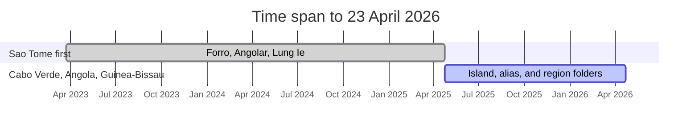
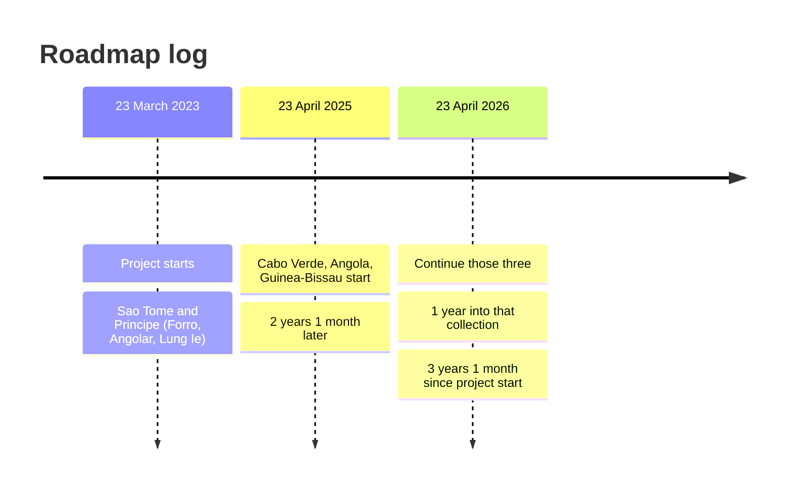

# Forro Languages Dictionary Data

**Project started:** 23 March 2023  

Open linguistic dataset for Portuguese-lexifier creoles, starting with the three indigenous creoles of São Tomé and Príncipe, plus Cabo Verde and Guinea-Bissau. Angolar is the principal Angola-related creole in this repository (`dictionary/angola/` aliases `dictionary/saotome/angolar/`):

| Language | Autonym | ISO 639-3 | Translation pairs |
|---|---|---|---|
| Forro (Santome / Santomense) | *lungwa santome* | cri | Forro ↔ Portuguese, Forro ↔ English |
| Angolar (Ngola) | *n'golá* | aoa | Angolar ↔ Portuguese, Angolar ↔ English |
| Principense (Lung’Ie) | *lung’Ie* | pre | Lung’Ie ↔ Portuguese, Lung’Ie ↔ English |
| Cabo Verdean (Kabuverdianu / Kriolu) | island varieties under `dictionary/caboverde/` | kea | each island ↔ Portuguese, each island ↔ English |
| Guinea-Bissau (Kriol / Kiriol) | regional varieties under `dictionary/guinebissau/` | pov | each region ↔ Portuguese, each region ↔ English |

The São Tomé and Príncipe languages are related Gulf of Guinea creoles. They are not mutually intelligible. Cabo Verdean island creoles and Guinea-Bissau regional Kriol are Upper Guinea creoles; they are not the same language. Cabo Verdean varieties are stored one island per folder. Guinea-Bissau varieties are stored one region per folder. In this repository, Angolar / Ngola is the principal Angola-related creole; `dictionary/angola/` is an alias of `dictionary/saotome/angolar/`. This project treats each language as its own lexicon.

This repository holds **language data** and a **read-only HTTP API** that serves those files. It is not a website and not the ForroVivo application.

Documentation: [CONTRIBUTING.md](CONTRIBUTING.md) · [SOURCES.md](SOURCES.md) · [METHODOLOGY.md](METHODOLOGY.md)

## Collection roadmap

Calendar intervals are measured between named dates. They do not use a live clock.

| Project started | Cabo Verde, Angola, Guinea-Bissau started | Gap after project start | 23 April 2025 to 23 April 2026 |
|---|---|---|---|
| 23 March 2023 | 23 April 2025 | **2 years 1 month** | **1 year** |

From 23 March 2023 to 23 April 2025 is **2 years 1 month**. From 23 April 2025 to 23 April 2026 is **1 year**. From 23 March 2023 to 23 April 2026 is **3 years 1 month**.



25 months of São Tomé work first, then 12 months of Cabo Verde, Angola, and Guinea-Bissau collection, through 23 April 2026.



| Date | What started | Time since 23 March 2023 | Status |
|---|---|---|---|
| 23 March 2023 | Project. São Tomé and Príncipe (Forro, Angolar, Lung’Ie). | Start | Under way |
| 23 April 2025 | Cabo Verde (by island), Angola (Angolar alias), Guinea-Bissau (by region). | 2 years 1 month later | Folders ready; lexicons not yet extracted |
| 2026 / 23 April 2026 | Continue Cabo Verde, Angola, and Guinea-Bissau from labelled sources only. | 3 years 1 month later (on 23 April 2026) | Collection year |

| Folder | Language | Isolation rule |
|---|---|---|
| `dictionary/caboverde/` | Kabuverdianu, one inhabited island per folder | Do not copy between islands. A form labelled only “Cape Verdean” stays out. |
| `dictionary/angola/` | Alias of Angolar / Ngola | Canonical lexicon stays in `dictionary/saotome/angolar/`. Do not grow a second list. |
| `dictionary/guinebissau/` | Kriol, one region per folder | Do not copy between regions. Do not insert Casamance Kriyol. |

São Tomé collection for Forro, Angolar, and Lung’Ie began with the project on 23 March 2023. That work is not delayed to 2025. Cabo Verdean Kabuverdianu is not Guinea-Bissau Kriol. Angola in this repository is Angolar, not Kimbundu, Umbundu, or Angolan Portuguese.

## Dataset layout

Follow `Three-Language Dictionary Data Collection Prompt.md`. Each language is isolated:

```text
dictionary/
│
├── index.md
│
├── saotome/
│   ├── dictionary.md
│   ├── dictionary.json
│   ├── sources.md
│   ├── forro/
│   ├── angolar/
│   └── lungie/
│
├── caboverde/
│   ├── dictionary.md
│   ├── dictionary.json
│   ├── sources.md
│   ├── santiago/
│   ├── fogo/
│   ├── maio/
│   ├── brava/
│   ├── saovicente/
│   ├── santoantao/
│   ├── saonicolau/
│   ├── sal/
│   └── boavista/
│
├── guinebissau/
│   ├── dictionary.md
│   ├── dictionary.json
│   ├── sources.md
│   ├── bissau/
│   ├── biombo/
│   ├── cacheu/
│   ├── oio/
│   ├── bafata/
│   ├── gabu/
│   ├── quinara/
│   ├── tombali/
│   └── bolama/
│
└── angola/
    ├── dictionary.md
    ├── dictionary.json
    └── sources.md
```

Forro is extracted from *Dicionário livre santome/português*. Angolar and Lung’Ie are isolated from sources that document those languages. Those three live under `dictionary/saotome/`. Cabo Verde is split by island under `dictionary/caboverde/`; Guinea-Bissau is split by region under `dictionary/guinebissau/`. Those lexicons start empty until cited sources are extracted. `dictionary/angola/` is an alias of Angolar. No folder borrows vocabulary from another.

## Goal

Build a verified, source-traced dictionary that later applications can consume.

Accuracy comes before coverage. A missing translation is better than a guessed one.

## Principles

1. **No invented words.** Every form, gloss, example, pronunciation, and cultural note must come from a cited source.
2. **Language isolation.** Never copy a word from one creole folder into another because the spellings look similar. Cabo Verdean island varieties are not interchangeable. Guinea-Bissau regional varieties are not interchangeable. Cabo Verdean Kriolu is not Guinea-Bissau Kriol. `dictionary/angola/` is an alias of Angolar, not a second language.
3. **Source on every entry.** Record the work, page or URL, and a confidence level.
4. **Orthography fidelity.** Keep the spelling used in the source. Do not “normalize” one language into another.
5. **Portuguese is not a creole.** São Toméan Portuguese is not Forro, Angolar, or Lung’Ie.

If a requested term is not attested for that language, the dataset records it as unavailable. Do not creolize Portuguese to fill the gap.

## API

The `api/` package is a read-only FastAPI service. It loads the existing `dictionary.json` files. It does not invent translations, merge languages, or write data.

```text
python3 -m venv .venv
source .venv/bin/activate
pip install -r api/requirements.txt
PYTHONPATH=. uvicorn api.main:app --reload --host 127.0.0.1 --port 8000
```

Interactive docs: `http://127.0.0.1:8000/docs`

| Method | Path | Role |
|---|---|---|
| GET | `/v1` | API metadata and license notice |
| GET | `/v1/datasets` | Isolated dataset catalog |
| GET | `/v1/saotome/forro` | Dataset metadata (same pattern for every lexicon) |
| GET | `/v1/saotome/forro/lookup?headword=kume` | Headword lookup in that dataset only |
| GET | `/v1/saotome/forro/entries?q=` | Paginated list / search inside that dataset |
| GET | `/v1/saotome/forro/entries/{id}` | One entry by id |
| GET | `/v1/angola/lookup?headword=` | Alias: serves `saotome/angolar`, does not grow a second lexicon |
| GET | `/v1/{dataset}/audio/{file}` | Audio from that dataset’s `Audio/` folder, when present |

Parent paths such as `/v1/caboverde/lookup` are indexes, not merged lexicons. They return `TERM_NOT_FOUND`. A missing headword in a lexicon returns that dataset’s `TERM_NOT_FOUND` object. Unknown paths return `DATASET_NOT_FOUND`.

Search never crosses folders. Forro `kume` is not an Angolar result.

The API is GET-only. New entries are added in the JSON files through the process in [CONTRIBUTING.md](CONTRIBUTING.md).

## Repository contents

| File | Role |
|---|---|
| `dictionary/index.md` | Index of the isolated datasets |
| `dictionary/saotome/` | São Tomé and Príncipe country folder (Forro, Angolar, Lung’Ie) |
| `dictionary/saotome/forro/` | Forro dataset, including `Audio/` for APiCS Santome recordings |
| `dictionary/saotome/angolar/` | Angolar dataset (principal Angola-related creole; spoken on São Tomé) |
| `dictionary/saotome/lungie/` | Lung’Ie dataset |
| `dictionary/caboverde/` | Cabo Verdean island creoles (one folder per inhabited island) |
| `dictionary/guinebissau/` | Guinea-Bissau Kriol (one folder per region) |
| `dictionary/angola/` | Alias of `dictionary/saotome/angolar/` |
| `dictionary.md` | Small comparative seed (not a merged lexicon) |
| `api/` | Read-only HTTP API over the JSON files |
| `CONTRIBUTING.md` | How to add attested entries |
| `SOURCES.md` | Bibliography and per-folder source index |
| `METHODOLOGY.md` | Isolation, verification, and data model |
| `Three-Language Dictionary Data Collection Prompt.md` | Collection and verification rules |
| `LICENSE` | Project license and third-party notices |

## How to add an entry

See [CONTRIBUTING.md](CONTRIBUTING.md) and [METHODOLOGY.md](METHODOLOGY.md).

1. Search the isolated dictionary folders first.
2. Then check academic and institutional sources (ALUSTP, APiCS, published grammars and dictionaries).
3. Confirm which language the evidence belongs to.
4. Add the entry only for that language, with source and confidence.
5. Leave the other languages empty until they have their own citation.

Human-readable entries follow the format in section 17 of the collection prompt, one language per folder.

## Sources

See [SOURCES.md](SOURCES.md). Each language and variety also has its own `sources.md`.

Primary local sources:

- Araujo, Gabriel Antunes de; Hagemeijer, Tjerk. 2013. *Dicionário livre santome/português — Livlu-nglandji santome/putugêji*. São Paulo: Hedra. Forro (Santome) headwords, phonetics, Portuguese glosses, examples. ALUSTP orthography. Licensed **CC BY-NC**.
- Rougé, Jean-Louis; Schang, Emmanuel. 2012. “Histoire des créoles et génétique: le cas de l’angolar.” *Sciences et Techniques du Langage* 9. Forro / Angolar comparison, with some Lung’Ie cognates.

Published reference sources used in the seed:

- Hagemeijer, Tjerk. 2013. APiCS survey: Santome. <https://apics-online.info/surveys/35>
- Maurer, Philippe. 2013. APiCS survey: Angolar. <https://apics-online.info/surveys/36>
- Maurer, Philippe. 2013. APiCS survey: Principense. <https://apics-online.info/surveys/37>
- ALUSTP (2010): unified orthography proposal for Santome, Angolar, and Lung’Ie

Wikipedia, social media, unsourced word lists, and generated text are not accepted as the only evidence for an entry.

## License

Original project materials (this README, the collection rules, compilation structure, and independently authored notes) are licensed under [CC BY 4.0](https://creativecommons.org/licenses/by/4.0/).

That is the open license for **this project’s own work**. It does not replace the licenses of the dictionaries and papers we cite.

### Third-party material

| Material | Rights | What that means here |
|---|---|---|
| *Dicionário livre santome/português* (Araujo & Hagemeijer, 2013) | CC BY-NC | You may share and adapt **with attribution**, for **non-commercial** use only. |
| Rougé & Schang 2012 and other academic publications | Publisher / author copyright | Cite them. Do not treat them as CC BY 4.0. |
| APiCS Online (Michaelis et al., 2013), including Santome audio | CC BY 4.0 | Cite Hagemeijer and the APiCS editors. Audio in `dictionary/saotome/forro/Audio/` stays CC BY 4.0. |

If you reuse this repository, keep the author names, titles, and license notices.

Suggested attribution for this project:

> Forro Languages Dictionary Data, available under CC BY 4.0. Includes material from Araujo & Hagemeijer (2013), *Dicionário livre santome/português*, CC BY-NC.

Suggested attribution for the Santome dictionary:

> Araujo, Gabriel Antunes de; Hagemeijer, Tjerk. 2013. *Dicionário livre santome/português*. São Paulo: Hedra. CC BY-NC.

See `LICENSE` for the full legal text.

## Contributing

See [CONTRIBUTING.md](CONTRIBUTING.md).

Contributions should add **attested** data, not guessed translations.

Please:

- keep each creole in its own folder; never mix Cabo Verdean islands or Guinea-Bissau regions with each other; do not duplicate Angolar into `dictionary/angola/`
- cite a source for every new field
- copy example sentences from the source, do not invent them
- mark disagreements instead of silently choosing one form
- do not add ForroVivo, UI, or write APIs that invent translations

## Status

São Tomé and Príncipe datasets are under `dictionary/saotome/` (`forro/`, `angolar/`, `lungie/`). Cabo Verdean island folders are under `dictionary/caboverde/`. Guinea-Bissau region folders are under `dictionary/guinebissau/`. `dictionary/angola/` aliases Angolar. Forro English is `null` in the *Dicionário livre* dump because that source is Santome/Portuguese. Grow every language from cited sources only. Never complete a row by analogy.

The collection roadmap at the top of this README is the GitHub-visible timeline. Dates and time differences are the same as in `dictionary/index.md` and the Cabo Verde, Angola, and Guinea-Bissau folders.
